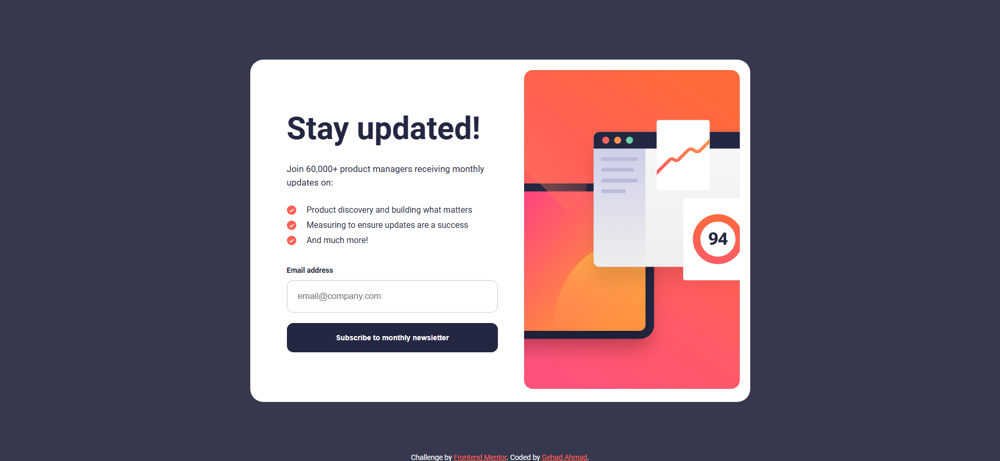
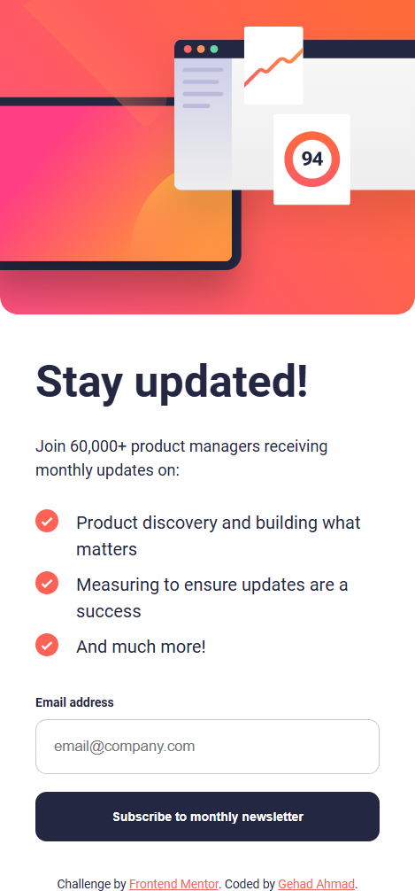

# Frontend Mentor - Newsletter sign-up form with success message solution

This is a solution to the [Newsletter sign-up form with success message challenge on Frontend Mentor](https://www.frontendmentor.io/challenges/newsletter-signup-form-with-success-message-3FC1AZbNrv).

## Overview

### The challenge

### Screenshot

#### Desktop View

#### Mobile View

### Links

- Solution URL: [https://github.com/Gehad28/sign-up-with-success-message](https://github.com/Gehad28/sign-up-with-success-message)
- Live Site URL: [https://gehad28.github.io/sign-up-with-success-message/](https://gehad28.github.io/sign-up-with-success-message/)

## My process

### Built with

- Semantic HTML5 markup
- CSS custom properties
- Flexbox
- CSS Grid
- Desktop-first workflow

## Author

- Website - [Gehad Ahmad](https://github.com/Gehad28)
- Frontend Mentor - [@Gehad28](https://www.frontendmentor.io/profile/Gehad28)
